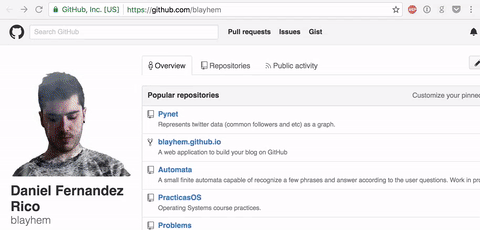

# Basic Social Network Scrapper.

This is a chrome extension that does exactly what it says:

> It extracts basic info from profiles in Twitter, Facebook or Github.

In order to install it:
 1. Download it and extract the .zip.
 2. Go to `chrome://extensions/`.
 3. Click on 'load unpacked extension', and open the folder.

This extension is **not really useful yet**, because the information that it shows is basically the name (or alias), the username and the profile picture, but keep in mind that **this is only a pet project to learn about Chrome extensions** that I coded in a few hours.
